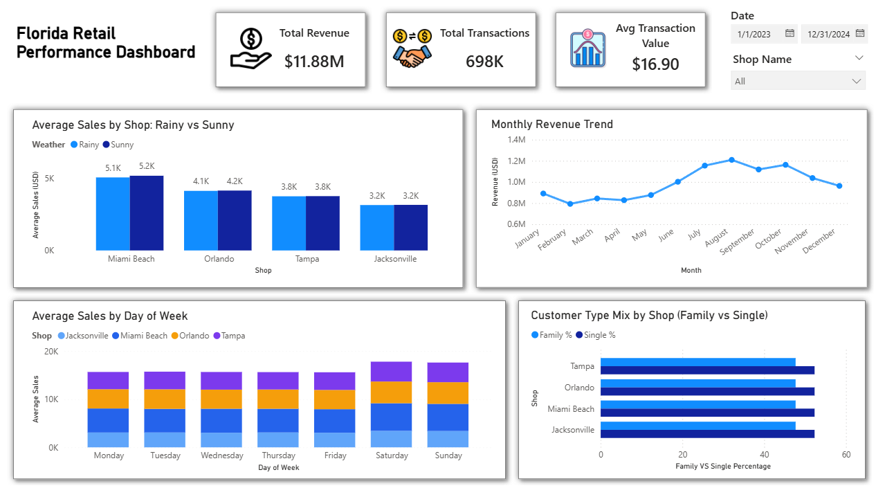

# Florida Retail Analysis: MySQL & Power BI Integration


## Project Overview
This project is an end-to-end data analysis solution for a Florida-based retail chain with branches in Miami, Orlando, Tampa, and Jacksonville. The primary objective was to determine how external factors (Weather) and internal factors (Demographics) influence daily sales performance.

**Technical Highlight:**
This project marks a strategic transition from SQL Server (SSMS) to **MySQL**. It demonstrates the ability to adapt to different database environments, handle complex data cleaning (Data Hardening), and establish ODBC connections for visualization.

## Business Problem
* **The Issue:** Daily sales fluctuate significantly, but management relies on intuition rather than data to explain why.
* **The Hypothesis:** There is a strong internal belief that "Rainy days negatively impact sales," leading to hesitant marketing decisions during wet seasons.
* **The Goal:** Provide fact-based insights to optimize staffing schedules and validate the weather impact assumption.

## Key Business Insights
Based on the analysis of 2 years of transactional data:

1.  **The "Rain Effect" Myth Busted**
    Contrary to popular belief, rain has **negligible impact** on sales performance. Analysis shows average daily revenue remains consistent (~$3,000 - $5,000 range) regardless of weather conditions across Orlando, Tampa, and Jacksonville.
    * *Recommendation:* Marketing campaigns should continue year-round without fear of weather disruptions.

2.  **Peak Operational Times**
    **Weekends (Saturday & Sunday)** consistently show the highest traffic volume.
    * *Recommendation:* Staffing levels must be maximized on weekends to prevent bottlenecks.

3.  **Customer Demographics**
    The customer base is evenly split between **Families (~55%)** and **Singles (~45%)**.
    * *Recommendation:* Promotional strategies should remain broad, targeting both segments rather than niche marketing.

4.  **Top Performer**
    **Miami Beach** is the highest revenue-generating store ($3.7M Total Revenue), driven by high traffic volume rather than high average spending per customer.

---

## Technical Implementation

Unlike standard tutorials, this project was built from the ground up to simulate a real-world working environment, focusing on problem-solving and data integrity.

### 1. Database Engineering (MySQL)
* **Data Hardening:** Fixed critical data quality issues where dates were imported as `TEXT` strings. Utilized `STR_TO_DATE` and `ALTER TABLE` to enforce strict `DATE` data types for accurate Time Intelligence analysis.
* **Logic Encapsulation (SQL View):** Created a unified view `vw_retail_master` to join Sales, Weather, and Survey tables.
    * *Optimization:* Embedded mathematical calculations (e.g., `Average_Transaction_Value`) directly into the SQL View, reducing processing load on Power BI.
* **Analytical Correction:** Solved the "Sum of Averages" fallacy. Ensured accurate aggregation by using `SUM(sales_usd)` for totals and `AVG(sales_usd)` for performance comparison, avoiding misleading statistical results.

### 2. Visualization (Power BI)
* **ODBC Connectivity:** Successfully configured `MySQL Connector/ODBC` to bridge the gap between the local MySQL server and Power BI Desktop.
* **Data Modeling:** Transformed text-based dates into valid Date hierarchies within Power Query to enable Year-over-Year analysis.
* **DAX Measures:** Implemented custom columns (e.g., `DayName`) to sort and visualize weekly traffic trends correctly (Monday to Sunday).

## Project Structure

```text
├── data/
│   ├── sales_2yrs.csv        # Raw Transaction Data
│   ├── weather_2yrs.csv         # Weather Conditions
│   └── survey_2yrs.csv         # Customer Survey Data
│
├── visualization/
│   ├── Florida_Retail_Dashboard.pbix  # Final Power BI File
│   └── dashboard_final.png            # Dashboard Screenshot
│
├── retail_analysis.sql               # Complete SQL Script
│
└── README.md                    # Project Documentation
```

## Dashboard Preview


## Attribution & Methodology

* **Dataset Source:** Adapted from the [Absent Data](https://www.youtube.com/watch?v=Hh5-Y_6v5iU) case study.
* **Implementation Note:** While the dataset and business context were sourced from the tutorial, the **SQL logic, database architecture, error troubleshooting, and dashboard design** were implemented independently to simulate real-world problem-solving requirements.

---

*Implementation by [Muhammad Zaenal Abidin Abdurrahman](https://www.linkedin.com/in/zendin1102/) - 2026*

